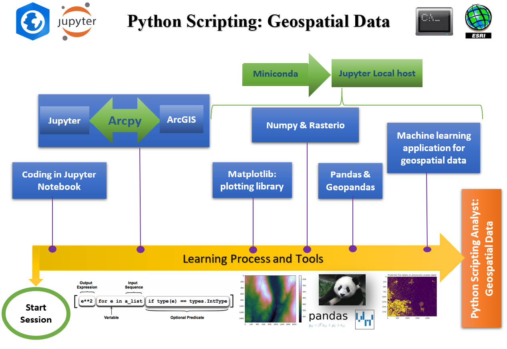

# Welcome to Geospatial Data Analysis

Author<br>
Dr. Suborna Ahmed, Forest Resources Management, UBC

## Introduction

Welcome to .....



## Outline

### License

```{admonition} **How to cite**
:class: tip

Ahmed, S., & Howard, C. (2023). Application of Computer Technology and Document Processing in Forestry Management. Add DOI.

```

**Version history** <br>
Materials were prepared for this book at the Faculty of Forestry, University of British Columbia, August, 2023.
